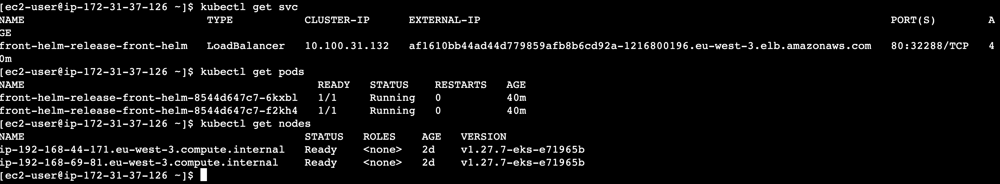
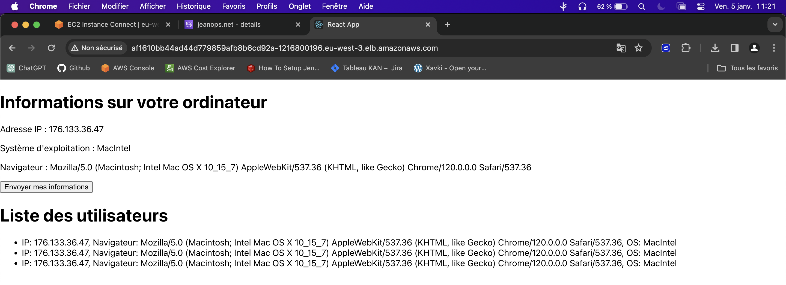

# Front Kubernetes deployment with Helm

## Project overview
This project proposes a deployement for the front application to a Kubernetes cluster using Helm.

## Prerequisites
- Kubernetes Cluster (Amazon EKS)
- Helm installed in your local machine or a EC2 instance Amazon Linux
- AWS CLI configured with the necessary permissions
- Docker image of the front-end application in AWS ECR

## Helm chart structure
The Helm chart for this project includes the following key components:
- `Chart.yaml`: Metadata about the Helm chart.
- `values.yaml`: Default values for the Helm chart configuration.
- `templates/deployment.yaml`: Kubernetes deployment configuration.
- `templates/service.yaml`: Kubernetes service configuration.
- `templates/hpa.yaml`: (Optional) Horizontal Pod Autoscaler configuration.
- `templates/_helpers.tpl`: Helper templates for naming standards.

## Steps to deploy

### 1. Clone the repository
Clone this repository to your local machine:
```bash
git clone https://github.com/Jean-Quenault/front-helm
cd front-helm
```

### 2. Configure Helm chart
Edit the `values.yaml` file to set your application's Docker image, resource requests, limits, and other configurations.

### 3. Install the Helm chart
Deploy the application to your Kubernetes cluster using Helm:
```bash
helm install [release-name] ./
```
Replace `[release-name]` with your desired release name.

### 4. Verify deployment
Check the status of the deployment:
```bash
kubectl get deployments
kubectl get pods
kubectl get services
```



## Scaling the application
To scale the application, you can update the `replicaCount` in the `values.yaml` file or use the Horizontal Pod Autoscaler (HPA) if configured.

## Updating the application
To update the application, make changes to the Helm chart and upgrade the release:
```bash
helm upgrade [release-name] ./
```



## Troubleshooting
- **Pods in pending state**: Check for resource limits, node availability, or taints in the cluster.
- **Helm release name conflicts**: Ensure that the release name is unique within the cluster.

## Adding nodes to the EKS cluster
To handle increased load or demand, you can scale your EKS cluster by either increasing the size of an existing node group or by adding a new node group through the AWS EKS console.